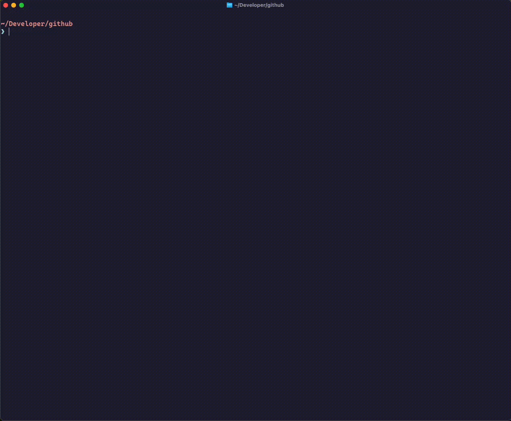

# Django with Vite and Inertia

[](https://github.com/copier-org/copier)

Set up your Django project with [Vite](https://vite.dev/) and [Inertia](https://inertiajs.com/).

Other configurations:

- Database (PostgreSQL, SQLite)
- Frontend:
  - Vue
  - React
  - Svelte
- Tailwind CSS (optional)
- Docker (optional)
  - Development
  - Production



> [!NOTE]
> SQLite is configured for production use if you choose to use it.

## Getting started

- (Recommended) Using [uv](https://docs.astral.sh/uv/) or [pipx](https://pipx.pypa.io/stable/)

```bash
mkdir awesome-project
uvx copier copy gh:sarthakjariwala/django-vite-inertia awesome-project
```

OR

```bash
mkdir awesome-project
pipx run copier copy gh:sarthakjariwala/django-vite-inertia awesome-project
```

- Alternatively, you may have installed [copier](https://copier.readthedocs.io/en/stable/) through other means.

```bash
mkdir awesome-project
copier copy gh:sarthakjariwala/django-vite-inertia awesome-project
```

## Update project template

You can also get the latest changes in your project as this template evolves in the future.

```bash
cd awesome-project
uvx copier update
```

Or

```bash
cd awesome-project
copier update
```

## License

MIT License

## Acknowledgements

Standing on the shoulders of giants:

- [Django](https://www.djangoproject.com/)
- [Vite](https://vitejs.dev/)
- [Inertia](https://inertiajs.com/)
- [Django Vite](https://github.com/MrBin99/django-vite)
- [Django Inertia](https://github.com/inertiajs/inertia-django)
